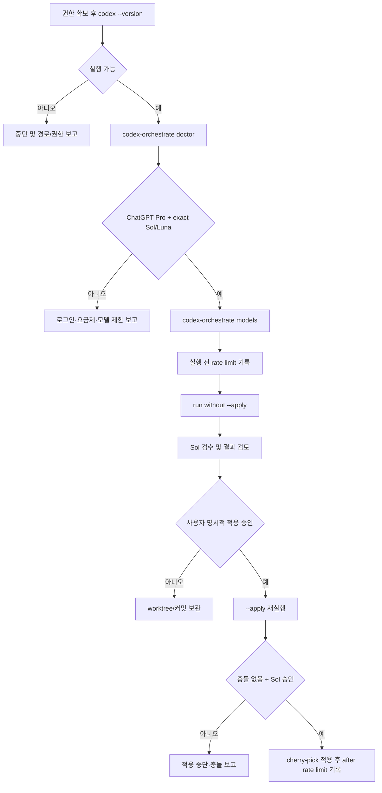

# Codex App Server 오케스트레이터 다음 단계 작업 설계도

## 문서 상태

- 상태: Draft / 권한 확인 후 실행 대기
- 기준일: 2026-08-09
- 범위: 실제 Codex CLI 접근 권한 확인, 실계정 읽기 전용 사전 점검, 첫 실제 실행과 적용 전환
- 기존 승인 설계: [`2026-08-04-codex-orchestrator-design.md`](../specs/2026-08-04-codex-orchestrator-design.md)를 유지하며 변경하지 않는다.
- 이번 단계에서는 권한을 변경하거나 실제 모델 turn을 실행하지 않는다.

## 1. 목표

Mock 환경에서 검증된 오케스트레이터를 실제 ChatGPT Pro Codex 환경으로 안전하게 연결한다.

성공 조건은 다음과 같다.

1. 실행 가능한 `codex` CLI와 버전을 확인한다.
2. App Server의 `initialize` → `initialized` 핸드셰이크가 성공한다.
3. `account/read`에서 `type=chatgpt`, `planType=pro`를 확인한다.
4. `model/list`에서 숨김이 아닌 정확한 `gpt-5.6-sol`, `gpt-5.6-luna`를 확인한다.
5. Sol/Luna가 지원하는 추론 단계와 실행 전 rate limit을 기록한다.
6. 첫 실제 작업은 기본 검수 모드로 실행하고, `--apply`는 별도 승인 후 사용한다.

## 2. 현재 상태와 외부 차단

구현 및 Mock 검증은 완료되어 있다.

- Node.js 20+ TypeScript CLI 구현 완료
- stdio JSON-RPC App Server 클라이언트 구현 완료
- Sol 계획·검수, Luna 병렬 워커, DAG 스케줄러, worktree 격리, 재시도, 구조화 로그 구현 완료
- 일반 테스트는 Mock App Server만 사용
- 실제 환경에서는 Windows Appx의 `codex.exe`가 `Access is denied`/`spawn EPERM`으로 실행되지 않음

따라서 권한 확인 전에는 다음을 수행하지 않는다.

- 실행 권한 변경
- Codex 재설치 또는 시스템 설정 변경
- API 키 추가
- 실제 모델 turn 시작
- `--apply` 실행

## 3. 운영 흐름



## 4. 단계별 작업

### 단계 A — 권한 확인 전 준비

권한 확인 없이 수행할 수 있는 작업이다.

- `pnpm install --frozen-lockfile --offline`
- `pnpm run check`
- `pnpm orchestrator:mock`
- `node tools/codex-orchestrator/dist/cli.js --help`
- Mock 로그와 worktree 보존 정책 확인

완료 기준:

- 루트 검사와 오케스트레이터 검사가 통과한다.
- Mock 실행에서 실제 OpenAI/Codex 네트워크 호출이 없다.
- 현재 작업 트리의 사용자 변경을 삭제하지 않는다.

### 단계 B — Codex 실행 파일 확인

권한이 확보된 일반 PowerShell에서 실행한다.

```powershell
codex --version
```

`codex`가 PATH에 없으면 사용자가 승인한 실행 파일 경로만 사용한다.

```powershell
$env:CODEX_ORCHESTRATOR_CODEX_PATH = "C:\\path\\to\\codex.exe"
codex-orchestrate doctor --cwd .
```

금지 사항:

- `OPENAI_API_KEY` 또는 `CODEX_API_KEY`를 해결책으로 설정하지 않는다.
- App Server 명령을 다른 전송으로 바꾸지 않는다.
- 테스트용 `CODEX_ORCHESTRATOR_APP_SERVER_*` 변수를 운영 환경에 사용하지 않는다.

실패 시 수집할 정보:

- `codex --version`의 전체 오류 코드
- 실제 실행 파일 경로
- 운영체제 및 Node.js 버전
- `doctor`의 구조화된 오류 코드

### 단계 C — 읽기 전용 실계정 사전 점검

`doctor`는 모델 turn을 시작하지 않는다.

```powershell
codex-orchestrate doctor --cwd .
codex-orchestrate models --cwd .
```

검증할 값:

- Codex CLI 버전
- `account.type === "chatgpt"`
- `account.planType === "pro"`
- exact visible model id/model 쌍
- Sol의 `max` 지원 여부
- Luna의 가장 빠른 단계와 어려운 작업용 높은 단계
- 실행 전 `account/rateLimits/read`

중단 조건:

- 로그아웃: `chatgptDeviceCode` 로그인 안내
- API 키: 즉시 중단 및 ChatGPT 인증 전환 안내
- Pro 아님: 즉시 중단
- 필수 모델 누락 또는 hidden: 대체 모델 없이 정확한 목록 출력 후 중단
- 모델 reroute 또는 malformed response: 즉시 중단

### 단계 D — 첫 실제 작업: 검수 전용 실행

실제 모델 사용량을 소비하므로 사용자가 명시적으로 실행할 때만 수행한다.

```powershell
codex-orchestrate run `
  --goal "로그인 기능을 분석하고 테스트까지 추가해줘" `
  --cwd . `
  --workers 4
```

기본 결과:

- Sol 계획 결과
- 태스크별 Luna 결과
- 변경 파일과 테스트 결과
- Sol 검수 결과
- 실행 전·후 rate limit
- 커밋 또는 패치 정보
- 실제 원본 브랜치에는 자동 병합하지 않음

첫 실행에서는 다음을 확인한다.

- 독립 태스크만 병렬 실행되는가
- writable path가 겹치는 태스크가 직렬화되는가
- retry가 태스크당 최대 2회인가
- 동일 task/feedback 중복 실행이 차단되는가
- 원본 dirty 파일이 변경되지 않는가
- `.codex-orchestrator/runs/<run-id>.jsonl`에 민감정보가 없는가

### 단계 E — 적용 전환

검수 전용 실행 결과를 확인한 뒤 별도 명시가 있을 때만 적용한다.

```powershell
codex-orchestrate run `
  --goal "로그인 기능을 수정하고 검증해줘" `
  --cwd . `
  --workers 4 `
  --apply
```

적용 전 필수 조건:

- Sol `approved=true`
- 모든 태스크가 approved
- `applyOrder`가 DAG 선행 관계를 만족
- 각 결과에 유효한 커밋이 있음
- 현재 사용자 dirty path와 커밋 파일이 겹치지 않음
- 사용자가 `--apply`를 명시함

충돌 시 동작:

- cherry-pick을 abort한다.
- 사용자 변경을 보존한다.
- 충돌 파일과 커밋을 보고한다.
- 자동 reset, clean, overwrite를 수행하지 않는다.

## 5. 책임과 산출물

| 단계 | 담당 | 산출물 |
|---|---|---|
| 권한 확인 | 사용자/환경 | 실행 가능한 Codex 경로와 버전 |
| 사전 점검 | CLI | 인증·요금제·모델·추론 단계·rate limit |
| 계획 | Sol | JSON Schema 기반 태스크 DAG |
| 실행 | Luna | 태스크별 결과, 테스트, 변경 파일, 커밋/패치 |
| 검수 | Sol | 승인·재시도 지시·적용 순서 |
| 적용 | 오케스트레이터 | 안전한 cherry-pick 또는 충돌 보고 |

## 6. 검증 명령 매트릭스

| 목적 | 명령 | 모델 사용 |
|---|---|---|
| 설치 재현성 | `pnpm install --frozen-lockfile --offline` | 없음 |
| 타입 검사 | `pnpm orchestrator:typecheck` | 없음 |
| 단위/Mock | `pnpm orchestrator:test` | 없음 |
| Mock 전체 실행 | `pnpm orchestrator:mock` | 없음 |
| CLI 확인 | `node tools/codex-orchestrator/dist/cli.js --help` | 없음 |
| 실계정 읽기 | `codex-orchestrate doctor` / `models` | 모델 turn 없음 |
| 실계정 통합 테스트 | `CODEX_ORCHESTRATOR_LIVE_TEST=1 ... test:integration` | 모델 turn 없음 |
| 실제 작업 | `codex-orchestrate run ...` | 사용량 소비 |
| 실제 적용 | `codex-orchestrate run ... --apply` | 사용량 소비 + 파일 적용 |

## 7. 완료 기준

다음 조건을 모두 만족하면 다음 단계가 완료된 것으로 본다.

- `codex --version` 성공
- `doctor` 성공
- `models`에서 exact Sol/Luna 확인
- ChatGPT Pro 인증 확인
- 읽기 전용 live integration test 성공
- 사용자 승인 후 첫 `run`이 성공하거나, 실패 원인이 구조화되어 재현 가능
- `--apply`는 승인된 커밋만 적용
- 실제 적용 후 원본 테스트와 dirty path 보존 확인

권한 오류나 계정/모델 제한이 하나라도 남아 있으면 완료로 표시하지 않고, 해당 단계에서 중단한다.

## 8. 다음 실행 시 입력

권한 확인을 완료한 뒤 다음 정보만 전달하면 된다.

1. `codex --version` 출력
2. `codex-orchestrate doctor --cwd .` 출력
3. `codex-orchestrate models --cwd .` 출력

그 결과를 바탕으로 실제 실행 목표와 `--workers`를 확정하고, `--apply` 여부를 별도로 결정한다.
